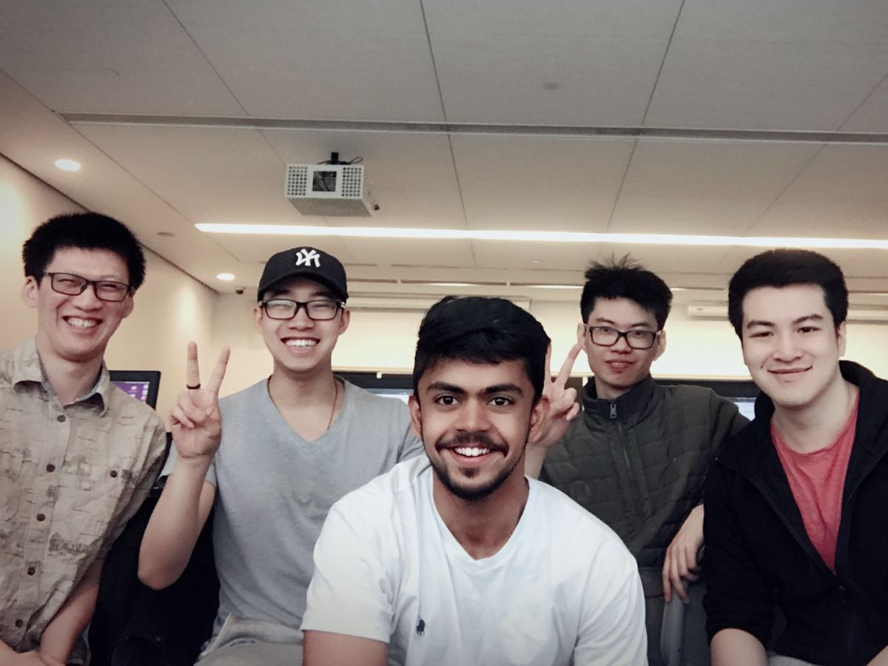

# Process
--------------------

Our group was created via a [post](https://piazza.com/class/jh9m0ftgr8l6x0?cid=13) on Piazza, from five individuals who did not know each other beforehand. There were six different deliverables for this phase of the project. We assigned a few people to complete most of each deliverable.

1. [summary.md](./summary.md) : Wayne
2. [competition.md](./competition.md) : Mak, Wayne, Jack
3. [personas.pdf](./personas.pdf) : Jack (Instructor), Mak (Student), Wayne (Guest)
4. [user_stories.md](./user_stories.md) : Kin, Jack
5. UI/UX : Yash (Login, Register, Account), Mak (Upload), Jack (Storyboard, Home, Results), Kin (Storyboard)
6. [process.md](./process.md) : Wayne

Everyone was able to make suggestions or changes to the documents as they are being completed. Decisions were made collectively, where the majority (at least 3 people) must approve the final version for submission.

We worked collaboratively in 2 group meetings on Wednesday and Friday, 3 hours each. All documents were stored online, so everyone could have access to work individually. Text (md) files were modified directly in the Bitbucket [team repository](./). Other binary files, where a PDF had to be generated, were created in a [shared folder](https://drive.google.com/drive/folders/1Vp_EavrXJuBndS51qNz5HwQQOdFwQoiO) on Google Drive. The UI/UX mockups were designed using [draw.io](https://www.draw.io/).

#TODO: add more tools used on the project

Our user stories are prioritized based on need. Core functionalities to a search engine, including the backend, are the highest priority; they are also illustrated in our UI/UX mockups. Features that enhance user experience (such as sorting or grouping the results) are the next priority. Nice-to-have features that are not related to search (such as favorites or user comments) are lower priority. We will consider additional features, if required, to be an extension to the scope of this project.

It was strongly encouraged to complete most of what was assigned by Friday, so we could address existing problems and take advantage of the office hours if needed. That did not happen - we were finally able to piece everything together at the last minute on the Tuesday due date. While there were certain tasks were successfully done in the in-person meetings, a stronger emphasis on work outside of the in-person meetings will need to be addressed for the future phases. Although everyone may have been busy with assignments in other courses, individual work on this phase of the project was not great.

#TODO: add more lessons learned here

The lesson learned here is to better define and enforce milestones for scheduling purposes; this might imply the need for a stronger team leader. Team members need to be more proactive in identifying and completing (at least) the necessary work defined in the handout. These issues have been communicated with all team members. Hopefully teamwork will improve in the next phase of our project.
