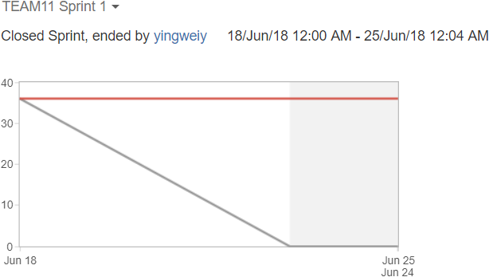
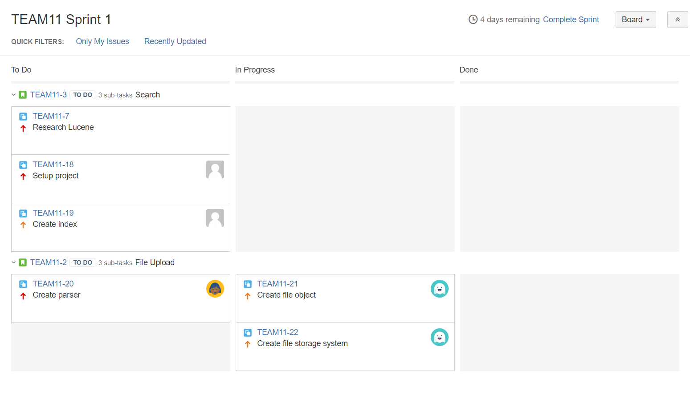
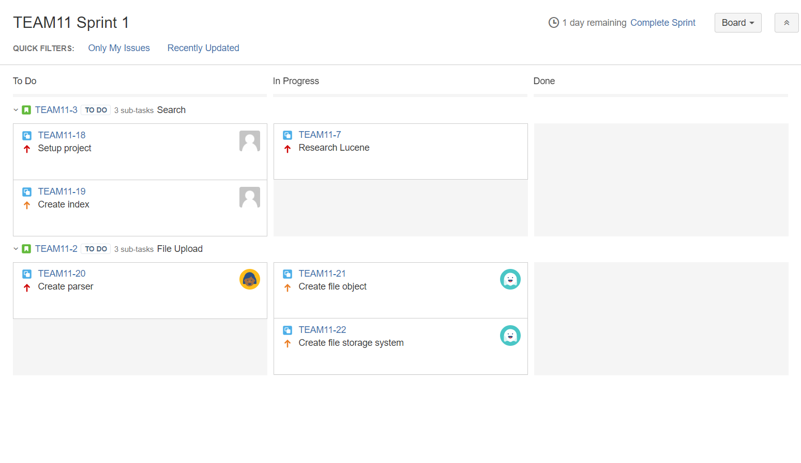
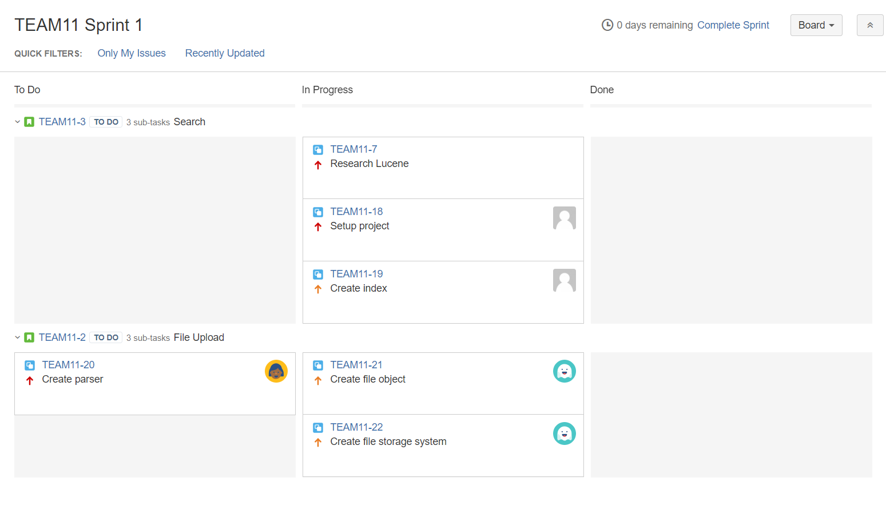

# Sprint 1 Summary
--------------------

## Burndown Chart

Our scrum velocity appears to be __0__. Several tasks are almost complete:

* [TEAM11-18] is waiting for pull request #1 approval
* [TEAM11-21] and [TEAM11-22] are under review, pending integration testing

## Task Board

### Start (Monday, June 18)

### Middle (Thursday, June 21)

### End (Sunday, June 24)

[TEAM11-18]: https://cmsweb.utsc.utoronto.ca/jira/browse/TEAM11-18
[TEAM11-21]: https://cmsweb.utsc.utoronto.ca/jira/browse/TEAM11-21
[TEAM11-22]: https://cmsweb.utsc.utoronto.ca/jira/browse/TEAM11-22
