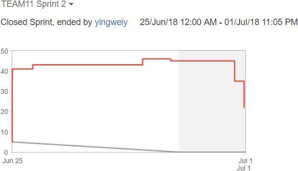
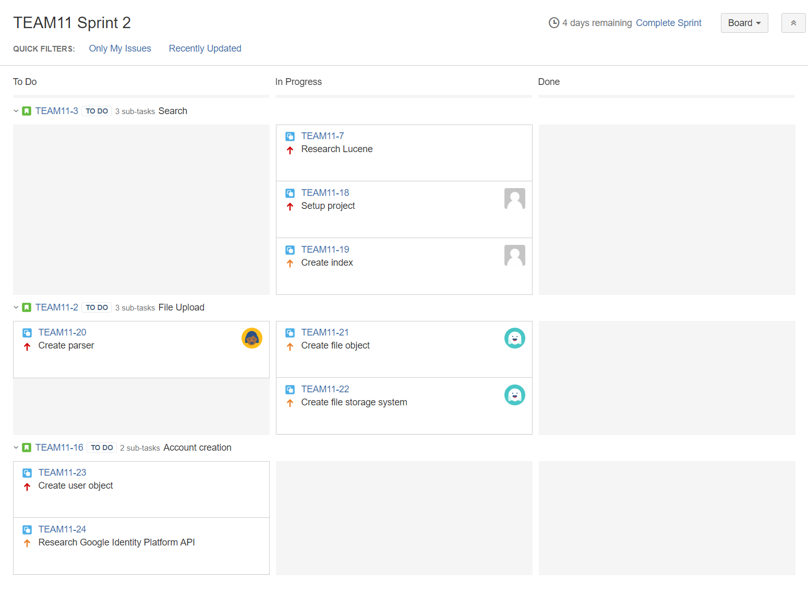
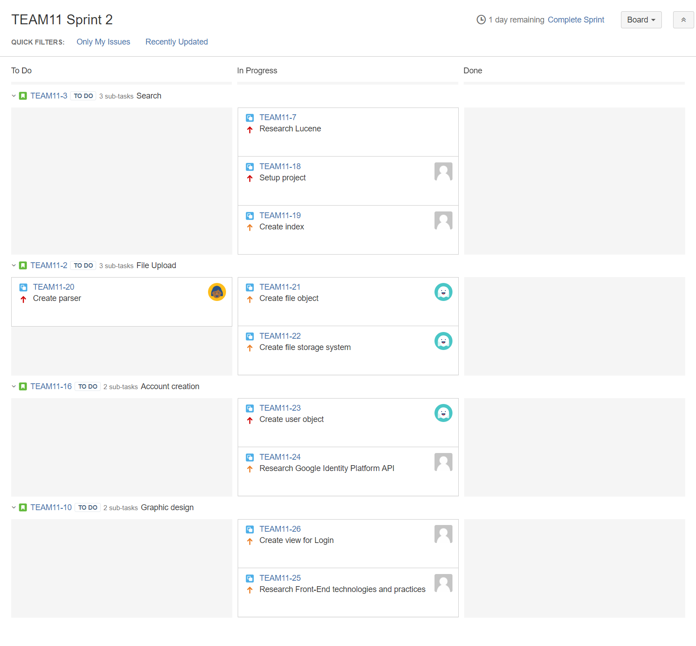
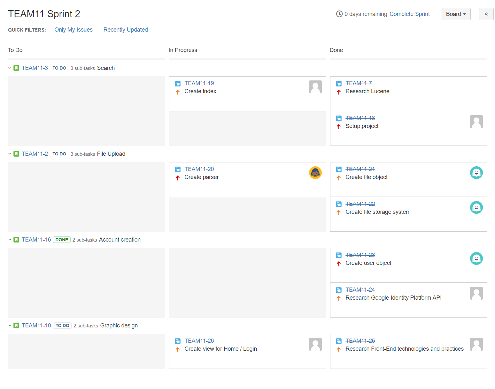

# Sprint 2 Summary
--------------------

## Burndown Chart

Our scrum velocity for this sprint is __32__. Our team was not able to finish all the tasks assigned to this sprint, but much progress has been made compared to last sprint. Team members gradually got used to process involved with committing their work on Bitbucket and updating the task statuses on JIRA.

The slight increase in story points is result of additional work identified during meetings on Monday and Friday. We realized it would be difficult to test and integrate individual components in the back-end without some parts of the front-end completed. Additional tasks ([TEAM11-25], [TEAM11-26]) were dedicated to the research and implementation of a simple front end.

The completion of story points was concentrated (sharp decrease) on the last day of the sprint because we did not consider a task complete until the pull request as approved and merged. Most of the merging happened on Sunday night.

The main technical problem right now is the integration of individual components, so everything works together. Unfortunately, we still have unresponsive team members despite the (almost) daily requests to provide an update. That is the top-priority issue that needs to be addressed moving forward.

These tasks are still in progress, more tasks will be added when appropriate:

* [TEAM11-19] - Index functionality is closely related to Search and still needs to be tested together.
* [TEAM11-20] - Basic parsing functionality has been completed and tested. However, the PDF parsing seems to require PDF files in a specific format/encoding for the text to be properly extracted. This will require adjustments in to the external library usage in the next sprint. 
* [TEAM11-26] - HTML and JavaScript files were added for the Home and Login page. At the moment they do not have controllers or services which handle interaction with the back-end, and more work on the CSS is needed to make the GUI more user-friendly. We will have to implement the aforementioned features in the next sprint.

## Task Board

### Start (Monday, June 25)

### Middle (Thursday, June 28)

### End (Sunday, July 1)

[TEAM11-19]: https://cmsweb.utsc.utoronto.ca/jira/browse/TEAM11-19
[TEAM11-20]: https://cmsweb.utsc.utoronto.ca/jira/browse/TEAM11-20
[TEAM11-25]: https://cmsweb.utsc.utoronto.ca/jira/browse/TEAM11-25
[TEAM11-26]: https://cmsweb.utsc.utoronto.ca/jira/browse/TEAM11-26
