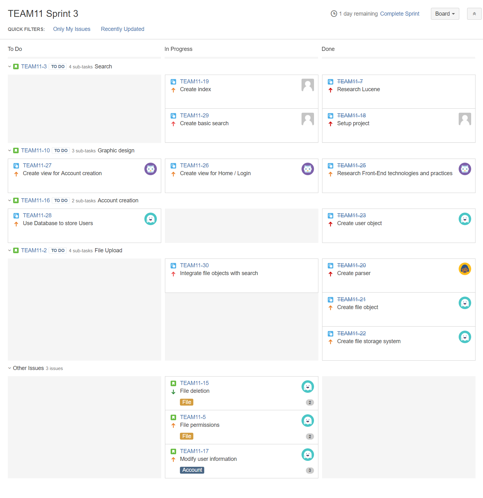

# Sprint 3 Summary
--------------------

## Burndown Chart

Our scrum velocity for this sprint is __32__. Our team was not able to finish all the tasks assigned to this sprint, but most of the blocking issues are just bugs in the code. The remaining task count and story points is the lowest since Sprint 1.

The increase in story points on Monday was caused by the re-evaluation of tasks after a meeting. The story point assignment was not up-to-date at the time of task assignment. Again, the completion of story points was concentrated (sharp decrease) on the last day of the sprint because the merging of branches happened on Sunday night.

We are making acceptable progress on all tasks except that we did not receive any updates on [TEAM11-28]. [TEAM11-17] and [TEAM11-30] encountered some bugs, which we will fix and complete in the next sprint.

## Task Board

### Start (Monday, July 2)

### Middle (Thursday, July 5)

### End (Sunday, July 8)

[TEAM11-17]: https://cmsweb.utsc.utoronto.ca/jira/browse/TEAM11-17
[TEAM11-28]: https://cmsweb.utsc.utoronto.ca/jira/browse/TEAM11-28
[TEAM11-30]: https://cmsweb.utsc.utoronto.ca/jira/browse/TEAM11-30
