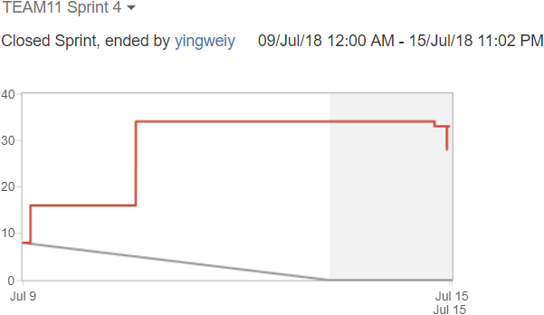
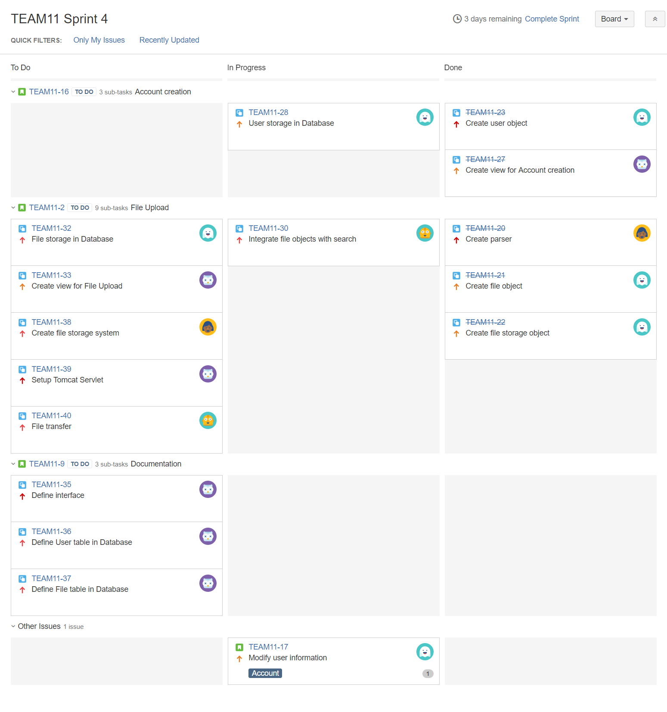
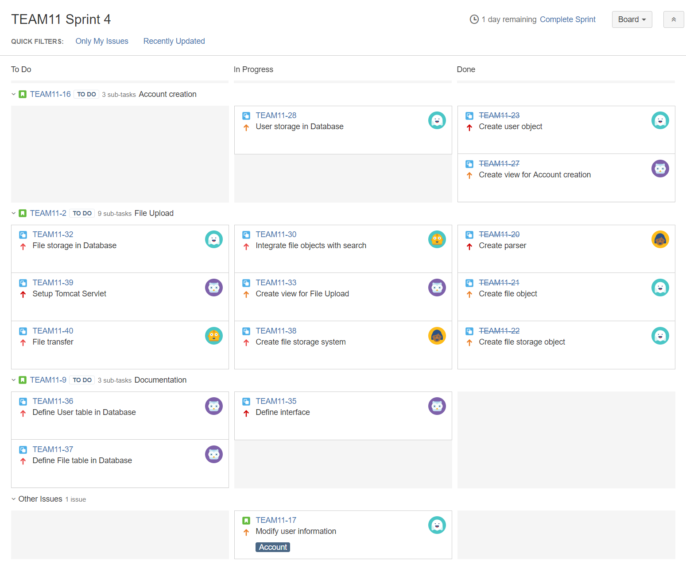
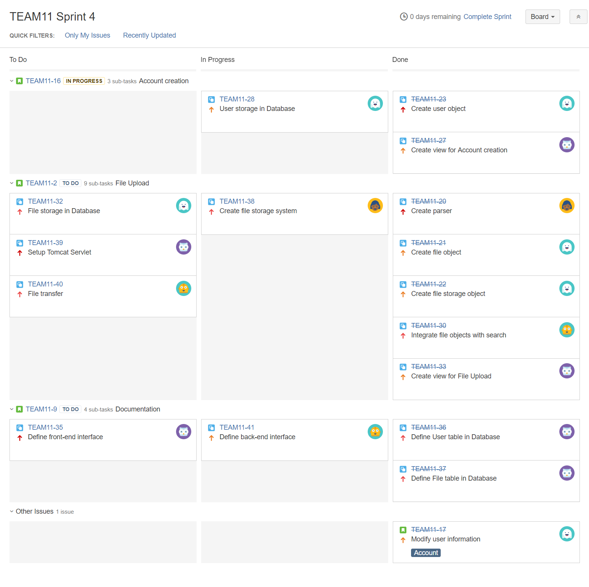

# Sprint 4 Summary
--------------------

## Burndown Chart

Our scrum velocity from the burndown chart appears to be __6__. However, the flat line is not accurate present our progress on tasks completion. We noticed around Wednesday all story point information was no longer editable in JIRA, which is otherwise how we manually prescribe a story point decrease when a sub-task is completed. Our scrum velocity with all sub-tasks considered like the previous sprints would have been __15__.

Our team was not able to finish all the tasks assigned to this sprint. The majority of our time was spent on defining Java function interfaces ([TEAM11-41]) and the restructuring our project ([TEAM11-30], [TEAM11-17]) to enable a better separation of tasks. We believe our teamwork (at least on the Java side) will be more efficient going forward.

The following tasks are still in progress:

* [TEAM11-28] - A complete database definition ([TEAM11-36]) was delayed. The implementation of User storage database is dependent on that task therefore still require some changes.
* [TEAM11-38] - An implementation of saving files on the local disk is completed. It is however pending server setup ([TEAM11-39], [TEAM11-40]) to validate if those functions will work in a Tomcat environment.
* [TEAM11-41] - The definition of internal Java interfaces in the UML is complete except for database related functions.

The increase in story points on Tuesday was caused by the re-evaluation of tasks after restructuring our project on Monday. The reason we did not make as much progress as we did on the previous sprints is primarily because efforts were diverted to completing Assignment 2.

## Task Board

### Start (Tuesday, July 10)

### Middle (Thursday, July 12)

### End (Sunday, July 15)

[TEAM11-17]: https://cmsweb.utsc.utoronto.ca/jira/browse/TEAM11-17
[TEAM11-28]: https://cmsweb.utsc.utoronto.ca/jira/browse/TEAM11-28
[TEAM11-30]: https://cmsweb.utsc.utoronto.ca/jira/browse/TEAM11-30
[TEAM11-36]: https://cmsweb.utsc.utoronto.ca/jira/browse/TEAM11-36
[TEAM11-38]: https://cmsweb.utsc.utoronto.ca/jira/browse/TEAM11-38
[TEAM11-39]: https://cmsweb.utsc.utoronto.ca/jira/browse/TEAM11-39
[TEAM11-40]: https://cmsweb.utsc.utoronto.ca/jira/browse/TEAM11-40
[TEAM11-41]: https://cmsweb.utsc.utoronto.ca/jira/browse/TEAM11-41
