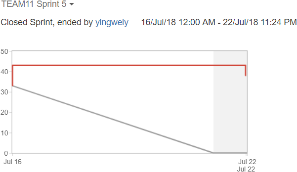
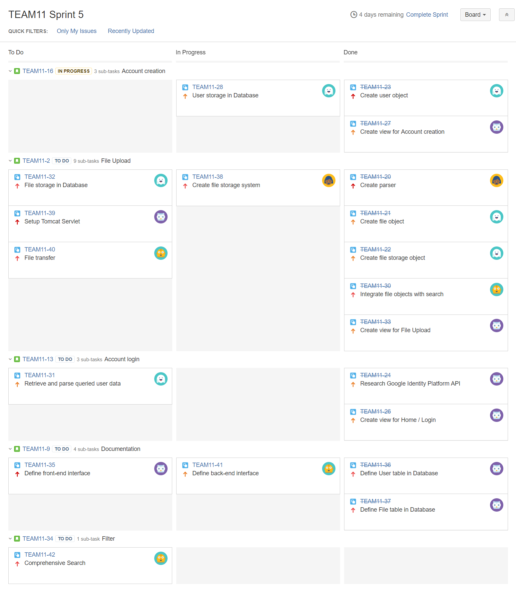
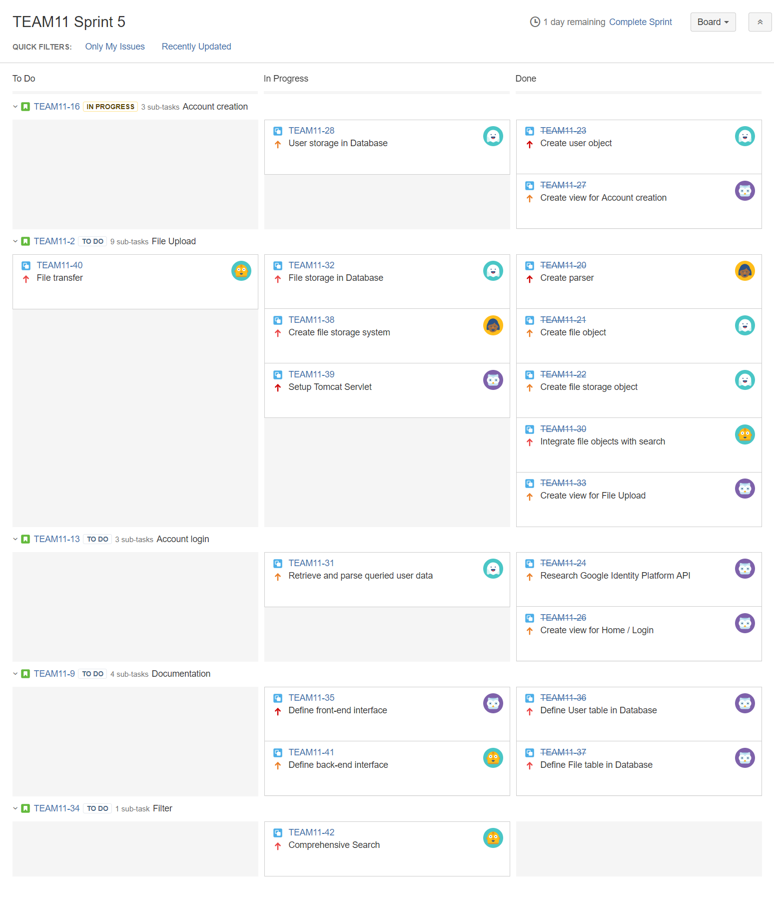
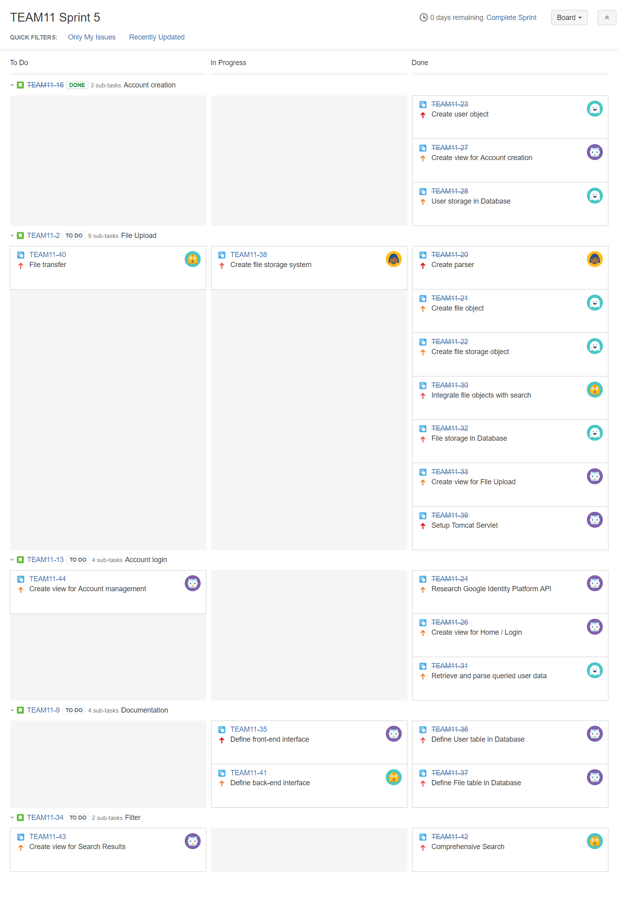

# Sprint 5 Summary
--------------------

## Burndown Chart

Our scrum velocity for this sprint should be __21__. The graph is again an inaccurate flat line because all story point information were no longer editable in JIRA, as noted in Sprint 4.

With the exception of [TEAM11-40], file transfer between the front-end and back-end, we are on track with our assigned tasks for this week. We completed the design and implementation of database related functionality, decided the integrate the front-end and back-end using the Spring Framework, and we will work towards that goal in the next sprint. [TEAM11-38], the file storage system, has been open without updates since last sprint, we will follow up with the appropriate team member to close the issue.

## Task Board

### Start (Monday, July 16)

### Middle (Thursday, July 19)

### End (Sunday, July 22)

[TEAM11-38]: https://cmsweb.utsc.utoronto.ca/jira/browse/TEAM11-38
[TEAM11-40]: https://cmsweb.utsc.utoronto.ca/jira/browse/TEAM11-40
