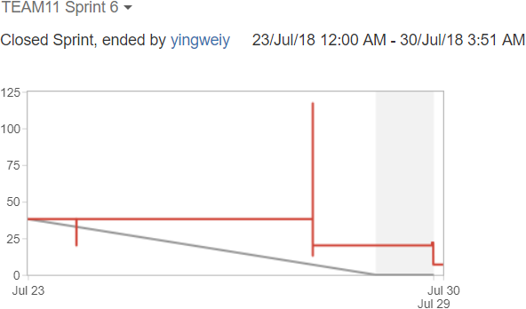
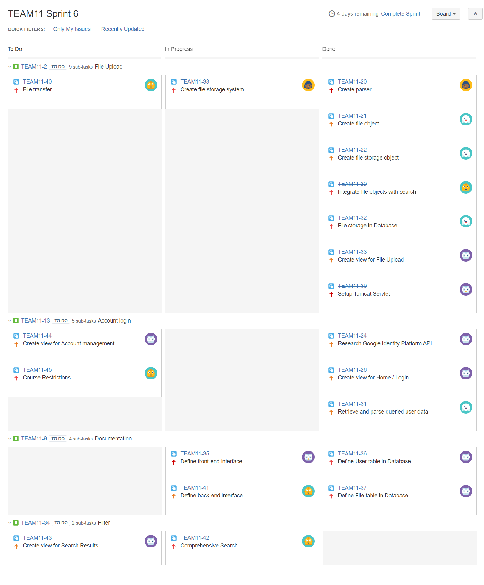
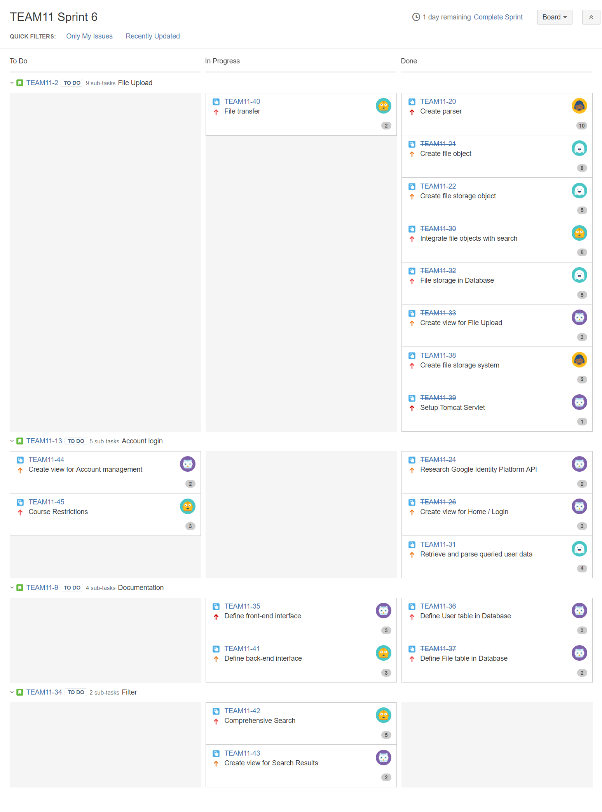
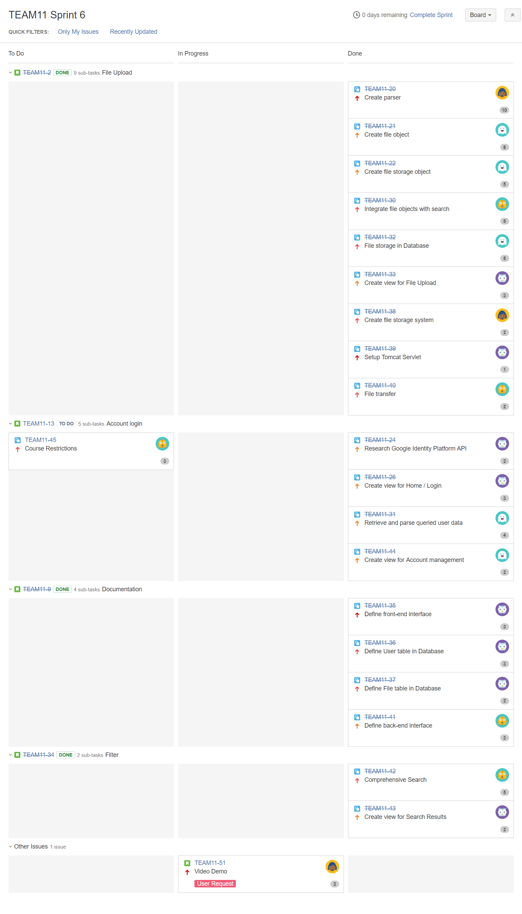

# Sprint 6 Summary
--------------------

## Burndown Chart

Our scrum velocity for this sprint is __34__. The spike in the graph was due to a typo when assigning story points on Thursday, that was the first chance we had to revise the JIRA tasks since the problem was resolved.

This sprint focused on integration of the front-end and back-end in preparation for the video recording ([TEAM11-51]) on Sunday. For the most part we were able to achieve all tasks - the basic user registration, search, index, and download features are working. [TEAM11-45] was a task to implement course restrictions on a user that may further enhance our advanced search capability. This non-essential feature has been postponed and we will focus on ironing our bugs for our next and last sprint. Some features the user specifically requested, such as an image background ([TEAM11-47]), Google chart statistics ([TEAM11-49]), or a web crawler ([TEAM11-48]) may be introduced if additional time is available.

## Task Board

### Start (Monday, July 23)

### Middle (Thursday, July 26)

### End (Sunday, July 29)

[TEAM11-45]: https://cmsweb.utsc.utoronto.ca/jira/browse/TEAM11-45
[TEAM11-47]: https://cmsweb.utsc.utoronto.ca/jira/browse/TEAM11-47
[TEAM11-48]: https://cmsweb.utsc.utoronto.ca/jira/browse/TEAM11-48
[TEAM11-49]: https://cmsweb.utsc.utoronto.ca/jira/browse/TEAM11-49
[TEAM11-51]: https://cmsweb.utsc.utoronto.ca/jira/browse/TEAM11-51
