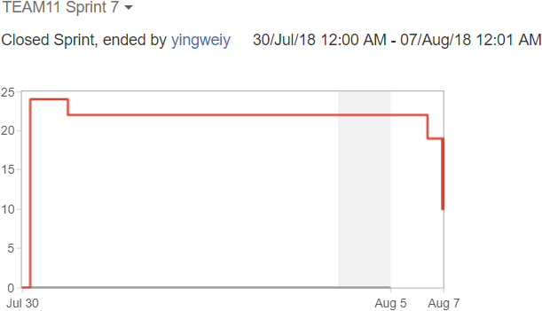
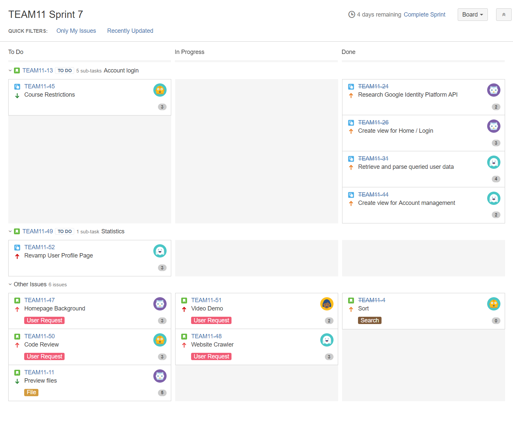
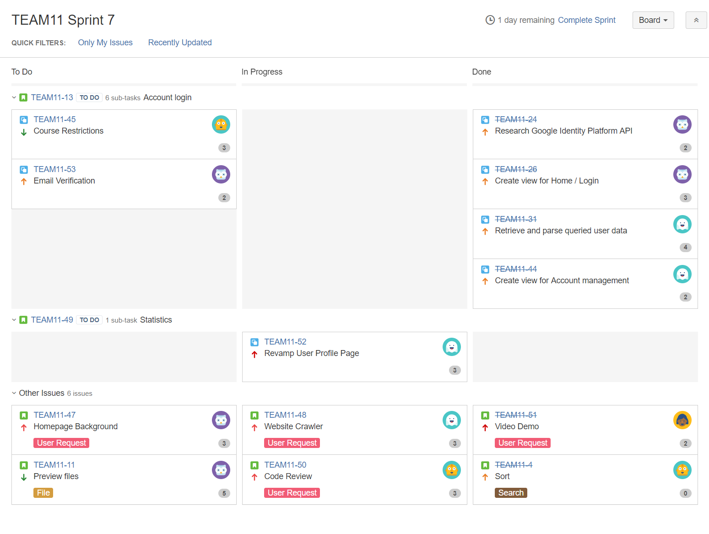
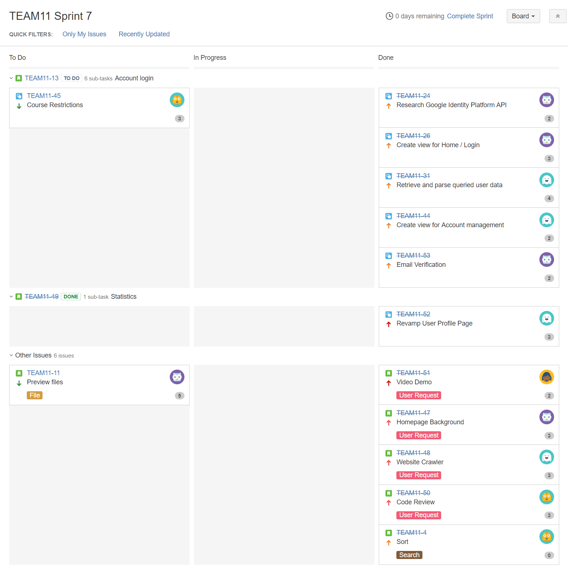

# Sprint 7 Summary
--------------------

## Burndown Chart

Our scrum velocity for this sprint is _14_. We were able to complete all of what planned before the deadline. The tasks remaining were nice-to-haves, not essential to this project, and therefore not started.

In this sprint, we redesigned the user interface for user profile and search pages, and added the features our client requested - an image background, Google chart statistics, and a web crawler. In addition, we implemented account verification via email. These are significant improvements that we believe the end product will satisfy our client's needs. On the downside, we could use some extra time of testing after integration.

## Task Board

### Start (Monday, July 30)

### Middle (Thursday, August 2)

### End (Monday, August 6)

